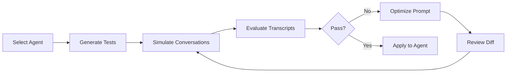

# Agent Performance Copilot

An automated **Validation Flywheel** for HighLevel Voice AI agents. It analyzes an agent's prompt, generates realistic test scenarios with measurable success criteria, simulates multi-turn phone conversations using two LLM instances (one as agent, one as caller), evaluates transcripts against the criteria, and rewrites the prompt to fix failures. The user reviews a before/after diff and applies the optimized prompt back to GHL with one click.

## Quick Start (Hosted)

The app is deployed and available as a GHL marketplace app:

1. [Install the app](https://marketplace.gohighlevel.com/oauth/chooselocation?response_type=code&redirect_uri=https%3A%2F%2Fapc-app.onrender.com%2Fauthorize-handler&client_id=699866a03dff6c0cb52ada83-mlv4nyfz&scope=voice-ai-agents.readonly+voice-ai-agents.write+voice-ai-dashboard.readonly&version_id=699866a03dff6c0cb52ada83) into your GHL sub-account
2. Navigate to the Custom Page "APC Home Page" created by the app
3. Select a Voice AI agent and start testing

Live URL: https://apc-app.onrender.com/ (this is loaded inside the marketplace and cannot be used as-is)

## Setup & Installation (Local Development)

### Prerequisites

- Node.js 18+
- A [HighLevel](https://www.gohighlevel.com/) sandbox account with a marketplace app
- An [Anthropic](https://console.anthropic.com/) API key

### Environment Variables

Copy `.env.example` to `.env` and fill in:

| Variable | Description |
|---|---|
| `GHL_APP_CLIENT_ID` | Marketplace app client ID |
| `GHL_APP_CLIENT_SECRET` | Marketplace app client secret |
| `GHL_APP_SSO_KEY` | SSO key from marketplace app settings |
| `GHL_API_DOMAIN` | `https://services.leadconnectorhq.com` |
| `ANTHROPIC_API_KEY` | Anthropic API key for Claude |
| `PORT` | Server port (default: `3000`) |
| `LOG_LEVEL` | `debug`, `info`, or `error` (default: `info`) |

For local development without ngrok, also add:

| Variable | Description |
|---|---|
| `DEV_ACCESS_TOKEN` | Access token copied from GHL Custom Page |
| `DEV_LOCATION_ID` | Location ID from the same Custom Page |

### Backend

```bash
npm install
npm run dev
```

### Frontend

```bash
cd src/ui
npm install
npm run build
```

The built frontend is served by the Express backend at the root URL.

### Running in GHL

1. Create a marketplace app and add OAuth scopes: `voice-ai-agents.readonly`, `voice-ai-agents.write`
2. Set the redirect URL to your deployed server's `/authorize-handler`
3. Create a Custom Page in a sub-account and point it to your server URL
4. For local dev: open the Custom Page once on a deployed instance, use the "Copy Dev Credentials" button (bottom-left of sidebar), paste into your local `.env`

## Architecture



The backend runs a 4-step prompt chain via LangChain + Anthropic Claude:

1. **Generate** -- analyze the agent prompt and produce test scenarios with success criteria
2. **Simulate** -- two LLM instances play agent and caller in a multi-turn conversation, with tool calling support
3. **Evaluate** -- judge the transcript against each criterion, produce per-criterion pass/fail
4. **Optimize** -- rewrite the prompt to fix failures while preserving working behavior

All structured outputs use Zod schemas to ensure valid JSON from the LLM. Orchestration lives in the frontend (Pinia store); each backend route handles one step.

See [docs/architecture.md](docs/architecture.md) for full technical details (routes, types, components, prompt templates).

## Team of One

### Product

- 5-step wizard flow (Select, Test, Results, Optimize, Apply) that mirrors a QA engineer's workflow
- Configurable test count (1-20), individual or batch test execution
- Re-run only failed tests after optimization to save time and API calls
- Baseline vs. latest pass rates to quantify improvement across iterations
- Full prompt diff on the Apply step so the user sees exactly what changes before committing

### Design

- DaisyUI v4 + Tailwind CSS, matching GHL's native look and feel
- Light theme, consistent blue primary, uniform typography across all pages
- Collapsible sidebar with step-completion indicators
- Chat bubbles for conversation transcripts, side-by-side diff panels with synced scrolling

### Engineering

- Backend: Express.js with service-layer architecture (routes, services, providers)
- LangChain + Markdown prompt templates + Zod schemas for structured LLM output
- Multi-turn conversation simulation with two LLM instances, tool calling support, and `MockToolExecutor` for realistic action results
- Frontend: Vue 3 + Pinia, props-driven component architecture with `App.vue` as the sole store consumer

### QA

- All backend services and frontend components are independently unit-testable via dependency injection and props-driven architecture

## What's Real vs. Mocked

- **Real**: GHL API calls (list, get, patch agents), all LLM calls (test generation, evaluation, optimization), prompt patching back to GHL
- **Mocked**: Conversation simulation - two LLM instances simulate the phone call instead of invoking real Voice AI telephony. Tool calls during simulation use `MockToolExecutor` which returns realistic fake data (booking confirmations, CRM updates, etc.)
- The real Voice AI agent can be tested manually via GHL's built-in web/phone call test feature

