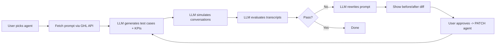

# Agent Performance Copilot — Architecture

## Product Flow



## Integration

- Custom Page module in GHL marketplace app (iframe loads Vue app)
- Assignment mentions "custom js" but Custom JS requires a 10-day review; Custom Page is practical and functional

## OAuth Scopes Required

Add these in marketplace app > Advanced Settings > Auth:

- `voice-ai-agents.readonly` — list and get agents
- `voice-ai-agents.write` — patch agent prompt
- `voice-ai-dashboard.readonly` — read call logs/transcripts (optional, for real call data)

## GHL APIs

All require sub-account access token (already handled by existing `ghl.ts`):

- `GET /voice-ai/agents` — list agents for the location
- `GET /voice-ai/agents/:agentId` — fetch agent config including prompt
- `PATCH /voice-ai/agents/:agentId` — push optimized prompt back

API version header: `Version: 2021-07-28`, Bearer auth.

## Backend Architecture

```
Routes → Services → Providers → External APIs

copilot.ts → testRunner.ts → (orchestrates)
             agentService.ts → ghlProvider.ts → GHL API
             llmService.ts  → LangChain      → Anthropic API
```

Build inside existing `src/`. Service-layer architecture:

### Config
- `src/config.ts` — centralized env vars (GHL + Anthropic API key)

### Types
- `src/types/agent.ts` — AgentConfig, AgentListResponse, PatchAgentRequest
- `src/types/testCase.ts` — TestCase, SuccessCriteria, TestScenario (+ Zod schemas)
- `src/types/evaluation.ts` — TestResult, ScoreCard, EvaluationReport (+ Zod schemas)
- `src/types/optimization.ts` — OptimizationResult, PromptDiff (+ Zod schemas)
- Private/internal types stay co-located next to their service file

### Middleware
- `src/middleware/errorHandler.ts` — centralized Express error handling
- `src/middleware/auth.ts` — extract `locationId` from request, validate installation exists
- `src/middleware/requestLogger.ts` — logs HTTP requests (method, path, duration)
- CORS configured in `src/index.ts` (needed for iframe → backend communication)

### Logging
- `src/utils/logger.ts` — pino-based logger, used by all services/providers
- `LOG_LEVEL` env var in config (`debug` | `info` | `error`)

### Providers (refactored from `ghl.ts`)
- `src/providers/ghlAuth.ts` — OAuth token exchange, refresh, storage (uses `Model`)
- `src/providers/ghlProvider.ts` — authenticated GHL API calls, Voice AI methods (uses `ghlAuth`)
- `src/utils/sso.ts` — SSO decryption (pure function, extracted from `ghl.ts`)
- LLM provider abstraction handled by LangChain (no custom provider file needed)

### Prompt Templates
- `src/prompts/generate.md` — system prompt for test case generation
- `src/prompts/simulate.md` — system prompt for conversation simulation
- `src/prompts/evaluate.md` — system prompt for transcript evaluation
- `src/prompts/optimize.md` — system prompt for prompt optimization
- Loaded as strings, passed into LangChain's `ChatPromptTemplate.fromTemplate()`

### Services
- `src/services/agentService.ts` — uses `ghlProvider` for Voice AI agent CRUD
- `src/services/llmService.ts` — uses LangChain + prompt templates for all 4 chain steps; Zod schemas for structured output parsing
- `src/services/testRunner.ts` — orchestrates the full test-optimize loop

### Routes
- `src/routes/auth.ts` — existing auth routes (extracted from `index.ts`):
  - `GET /authorize-handler` — OAuth code exchange
  - `POST /decrypt-sso` — SSO decryption
- `src/routes/copilot.ts` — copilot routes (all require `locationId` via query param):
  - `GET /api/agents?locationId=xxx` — list agents
  - `GET /api/agents/:id?locationId=xxx` — get agent details
  - `POST /api/agents/:id/test` — generate test cases
  - `POST /api/agents/:id/run` — run tests + evaluate
  - `POST /api/agents/:id/optimize` — generate optimized prompt
  - `PATCH /api/agents/:id/apply` — push new prompt to GHL

## Frontend (Vue.js + Pinia)

Build inside `src/ui/src/`. Match GHL look and feel. MVVM pattern via Vue + Pinia.

No Vue Router — single-page wizard flow with step-based state.

### State Management
- `src/ui/src/stores/copilotStore.ts` — Pinia store: holds current agent, test cases, scorecard, optimized prompt, wizard step, loading/error states

### API Layer (refactored from `ghl/index.js`)
- `src/ui/src/api/ssoClient.ts` — SSO postMessage + decrypt (extracted from existing `ghl/index.js`)
- `src/ui/src/api/copilotClient.ts` — calls backend copilot routes (list agents, generate tests, run, optimize, apply)
- Remove `src/ui/src/ghl/` folder after migration

### Components
- `src/ui/src/App.vue` — main wizard container, manages step flow
- `src/ui/src/components/AgentSelector.vue` — dropdown to pick a Voice AI agent
- `src/ui/src/components/PromptViewer.vue` — displays current agent prompt
- `src/ui/src/components/TestCasesTable.vue` — generated test cases + KPIs
- `src/ui/src/components/ScoreCard.vue` — pass/fail results per test
- `src/ui/src/components/PromptDiff.vue` — before vs. after prompt comparison
- `src/ui/src/components/LoadingSpinner.vue` — reusable loading indicator
- `src/ui/src/components/ErrorBanner.vue` — reusable error display

### Wizard Steps
1. Select agent → shows AgentSelector
2. View prompt → shows PromptViewer + "Generate Tests" button
3. Review tests → shows TestCasesTable + "Run Tests" button
4. View results → shows ScoreCard + "Optimize" button
5. Review optimization → shows PromptDiff + "Apply" / "Re-run" buttons


## LLM Integration (LangChain + Anthropic Claude)

Four prompt-chain steps:

1. **Generate**: Given agent prompt, produce test scenarios + success criteria
2. **Simulate**: LLM plays caller and agent, produces transcript (mocked — not real Voice AI)
3. **Evaluate**: Judge each transcript against success criteria, score pass/fail
4. **Optimize**: Take failures + original prompt, rewrite prompt to fix issues

Each step uses:
- MD file loaded into `ChatPromptTemplate`
- Zod schema for structured output validation
- `ChatAnthropic` as the model (swappable to any LangChain-supported provider)

## What's real vs. mocked

- **Real**: GHL API calls (list/get/patch agents), all LLM calls
- **Mocked**: Conversation simulation (LLM plays both sides instead of calling real Voice AI)
- Real Voice AI can be tested manually via GHL's built-in web/phone call test

## Env vars needed

- `GHL_APP_CLIENT_ID` (exists)
- `GHL_APP_CLIENT_SECRET` (exists)
- `GHL_APP_SSO_KEY` (exists)
- `GHL_API_DOMAIN` (exists)
- `ANTHROPIC_API_KEY` (new)
- `LOG_LEVEL` (new, default: `info`)
- `PORT` (exists)

## Dev Mode (local development without ngrok)

- Vue UI has a "Copy Dev Credentials" button (bottom-right) — copies access token, locationId, etc.
- Deploy to Render once, open Custom Page in GHL, copy credentials
- Paste into local `.env` as `DEV_ACCESS_TOKEN`, `DEV_LOCATION_ID`, etc.
- On startup, if dev credentials exist in `.env`, seed them into `Model` — skip OAuth entirely
- Develop fully on localhost until next push

## Refactoring existing code

- `src/ghl.ts` — split into `providers/ghlAuth.ts`, `providers/ghlProvider.ts`, `utils/sso.ts`
- `src/index.ts` — remove example routes, add CORS, wire auth + copilot routes + middleware
- `src/model.ts` — stays as-is
