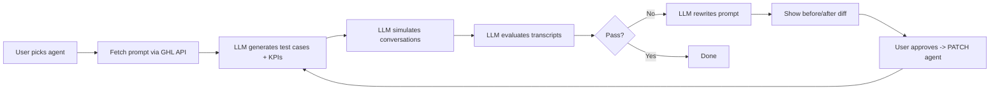

# Agent Performance Copilot — Architecture

## Product Flow



## Integration

- Custom Page module in GHL marketplace app (iframe loads Vue app)
- Assignment mentions "custom js" but Custom JS requires a 10-day review; Custom Page is practical and functional

## OAuth Scopes Required

Add these in marketplace app > Advanced Settings > Auth:

- `voice-ai-agents.readonly` — list and get agents
- `voice-ai-agents.write` — patch agent prompt

## GHL APIs

All require sub-account access token (handled by `ghlProvider.ts`):

- `GET /voice-ai/agents` — list agents for the location
- `GET /voice-ai/agents/:agentId` — fetch agent config including prompt
- `PATCH /voice-ai/agents/:agentId` — push optimized prompt back

API version header: `Version: 2021-04-15`, Bearer auth. Base URL: `https://services.leadconnectorhq.com`

## Backend Architecture

```
Routes → Services → Providers → External APIs

copilot.ts → agentService.ts → ghlProvider.ts → GHL API
             llmService.ts   → LangChain      → Anthropic API
             conversationSimulator.ts → (multi-turn simulation)
```

Orchestration of the test-optimize loop lives in the frontend (Pinia store), not a backend service. Each route handles one step; the frontend calls them in sequence.

Build inside existing `src/`. Service-layer architecture:

### Config
- `src/config.ts` — centralized env vars (GHL + Anthropic API key)

### Types
- `src/types/agent.ts` — AgentConfig, AgentAction, working hours, GHL agent data
- `src/types/testCase.ts` — TestCase, SuccessCriteria, TestGenerationResult (+ Zod schemas)
- `src/types/evaluation.ts` — TranscriptMessage, TestResult, SimulationResult (+ Zod schemas)
- `src/types/optimization.ts` — OptimizationResult, changes summary (+ Zod schemas)
- `src/types/simulation.ts` — ToolExecutor, ToolCallLogEntry, SimulationV2Result
- `src/types/express.d.ts` — extends Express Request with optional `locationId`

### Middleware
- `src/middleware/errorHandler.ts` — centralized Express error handling
- `src/middleware/auth.ts` — extract `locationId` from request, validate installation exists
- `src/middleware/requestLogger.ts` — logs HTTP requests (method, path, duration)
- CORS configured in `src/index.ts` (needed for iframe → backend communication)

### Logging
- `src/utils/logger.ts` — pino-based logger, used by all services/providers
- `LOG_LEVEL` env var in config (`debug` | `info` | `error`)

### Providers (refactored from `ghl.ts`)
- `src/providers/ghlAuth.ts` — OAuth token exchange, refresh, storage (uses `Model`)
- `src/providers/ghlProvider.ts` — authenticated GHL API calls, Voice AI methods (uses `ghlAuth`)
- `src/utils/sso.ts` — SSO decryption (pure function, extracted from `ghl.ts`)
- LLM provider abstraction handled by LangChain (no custom provider file needed)

### Prompt Templates
- `src/prompts/generate.md` — system prompt for test case generation
- `src/prompts/simulate.md` — system prompt for single-shot conversation simulation (legacy)
- `src/prompts/caller.md` — system prompt for the caller persona in multi-turn simulation
- `src/prompts/evaluate.md` — system prompt for transcript evaluation
- `src/prompts/optimize.md` — system prompt for prompt optimization
- Loaded as strings, passed into LangChain's `ChatPromptTemplate.fromTemplate()`

### Services
- `src/services/agentService.ts` — uses `ghlProvider` for Voice AI agent CRUD
- `src/services/llmService.ts` — uses LangChain + prompt templates for all 4 chain steps; Zod schemas for structured output parsing
- `src/services/conversationSimulator.ts` — multi-turn conversation simulation with two LLM instances (agent + caller), tool calling support, goodbye detection, transcript cleanup
- `src/services/mockToolExecutor.ts` — returns realistic mock responses for agent actions (booking, data extraction, SMS, etc.)

### Routes
- `src/routes/auth.ts` — existing auth routes (extracted from `index.ts`):
  - `GET /authorize-handler` — OAuth code exchange
  - `POST /decrypt-sso` — SSO decryption
- `src/routes/copilot.ts` — copilot routes (all require `locationId` via query param):
  - `GET /api/agents?locationId=xxx` — list agents
  - `GET /api/agents/:id?locationId=xxx` — get agent details
  - `POST /api/agents/:id/test` — generate test cases
  - `POST /api/agents/:id/run` — run tests + evaluate
  - `POST /api/agents/:id/optimize` — generate optimized prompt
  - `PATCH /api/agents/:id/apply` — push new prompt to GHL

## Frontend (Vue.js + Pinia)

Build inside `src/ui/src/`. Match GHL look and feel. MVVM pattern via Vue + Pinia.

No Vue Router — single-page wizard flow with step-based state.

### State Management
- `src/ui/src/stores/copilotStore.js` — Pinia store: agents, prompts, test cases, results, optimization, wizard step, loading/error states. All orchestration logic (calling API routes in sequence) lives here.

### API Layer
- `src/ui/src/api/copilotClient.js` — calls backend copilot routes (list agents, generate tests, run, optimize, apply)

### Components

All view components are **props-driven** and emit events — no direct store access. Only `App.vue` connects to the Pinia store and wires props/events to children. This makes every component independently testable.

**Layout:**
- `App.vue` — root wiring layer, connects store to all child components via props/events
- `AppLayout.vue` — app shell with collapsible sidebar navigation, error banner, middle panel slot

**Views (one per wizard step):**
- `AgentSelector.vue` — agent dropdown, prompt editor, test count input, generate button
- `TestCaseDetail.vue` — single test case scenario, persona, goal, success criteria, run buttons
- `ConversationView.vue` — simulated conversation transcript (chat bubbles) + evaluation results
- `OptimizationView.vue` — issue/fix cards, side-by-side original vs optimized prompt diff with synced scroll
- `ApplyView.vue` — baseline vs latest pass rates, per-test comparison table, apply/reset buttons

**List panels (left sidebar on test/results steps):**
- `TestCaseList.vue` — selectable list of test cases with status dots
- `TestResultsList.vue` — selectable list of results with pass/fail status and pass rate

**Shared components:**
- `AppButton.vue` — button with loading state and variants (primary, secondary, success, error)
- `AppDropdown.vue` — reusable dropdown with v-model support
- `StatusBadge.vue` — pass/fail/running badge with configurable color
- `ResultIcon.vue` — checkmark or cross SVG based on passed prop
- `EmptyState.vue` — placeholder for empty content areas

### Wizard Steps
1. **Select** → AgentSelector (pick agent, review prompt, set test count, generate)
2. **Test** → TestCaseList (left) + TestCaseDetail (right) — run tests individually or in batch
3. **Results** → TestResultsList (left) + ConversationView (right) — review transcripts + evaluations
4. **Optimize** → OptimizationView — review prompt changes, re-run failed or all tests
5. **Apply** → ApplyView — compare baseline vs latest pass rates, apply to agent or start over


## LLM Integration (LangChain + Anthropic Claude)

Four prompt-chain steps:

1. **Generate**: Given agent prompt + available tools, produce test scenarios + success criteria. Test count is user-configurable (1–20).
2. **Simulate**: Multi-turn conversation between two LLM instances — one plays the agent (with the real prompt + tool bindings), one plays the caller (with the test case persona/goal). The agent can invoke tools mid-conversation; a `MockToolExecutor` returns realistic fake results. Conversation ends on goodbye, empty response, or 12-turn limit. Transcript is cleaned of LLM meta-commentary.
3. **Evaluate**: Judge transcript against success criteria, produce per-criterion pass/fail with reasoning. `overallPass` is deterministically computed (all criteria must pass), overriding the LLM's own judgment.
4. **Optimize**: Take failures + original prompt, rewrite prompt to fix issues while preserving core behavior.

Each step uses:
- MD file loaded into `ChatPromptTemplate`
- Zod schema for structured output validation
- `ChatAnthropic` as the model (swappable to any LangChain-supported provider)

## What's real vs. mocked

- **Real**: GHL API calls (list/get/patch agents), all LLM calls (generation, evaluation, optimization), prompt patching back to GHL
- **Mocked**: Conversation simulation — two LLM instances simulate the call instead of invoking the real Voice AI telephony. Tool calls during simulation use `MockToolExecutor` which returns realistic fake data.
- Real Voice AI can be tested manually via GHL's built-in web/phone call test

## Env vars needed

- `GHL_APP_CLIENT_ID` (exists)
- `GHL_APP_CLIENT_SECRET` (exists)
- `GHL_APP_SSO_KEY` (exists)
- `GHL_API_DOMAIN` (exists)
- `ANTHROPIC_API_KEY` (new)
- `LOG_LEVEL` (new, default: `info`)
- `PORT` (exists)

## Dev Mode (local development without ngrok)

- Vue UI has a "Copy Dev Credentials" button (bottom-right) — copies access token, locationId, etc.
- Deploy to Render once, open Custom Page in GHL, copy credentials
- Paste into local `.env` as `DEV_ACCESS_TOKEN`, `DEV_LOCATION_ID`, etc.
- On startup, if dev credentials exist in `.env`, seed them into `Model` — skip OAuth entirely
- Develop fully on localhost until next push

## UI Architecture

- **DaisyUI v4** + **Tailwind CSS v3** for all styling — no custom CSS except sidebar theme and diff highlighting
- **Props-driven components** — every component (except `App.vue`) receives data via props and emits events, making them independently unit-testable without a Pinia store
- `App.vue` is the single wiring layer that connects the store to all child components
- Agent list is loaded once on mount; wizard navigation is step-based with accessibility guards
